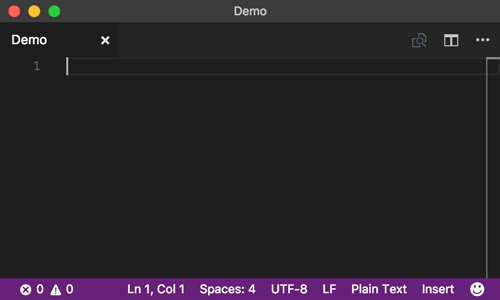

# Overtype for Visual Studio Code

[](https://open-vsx.org/extension/DrMerfy/overtype)
[](https://marketplace.visualstudio.com/items?itemName=DrMerfy.overtype)
[](https://github.com/DrMerfy/vscode-overtype/releases)
[](https://github.com/DrMerfy/vscode-overtype/issues)
[](https://github.com/DrMerfy/vscode-overtype/pulls)


Because some people actually press the Insert key on purpose.

## This is the continuation fork of the project :) 
## Original author: [Adam Maras](https://github.com/AdamMaras)

## Features

Adds an overtype mode to Visual Studio Code, plus a couple of bells and whistles.

### Basic usage

The aptly named **overtype mode** allows one to type over and replace existing characters in one's text editor. The most common scenario for overtype mode is when it's activated by accident by an unsuspecting user who can't figure out why the computer is eating all the words they already typed.

To toggle overtype mode, press the `Insert` key. If you don't have an `Insert` key, you can press `Ctrl+Shift+I` (on Windows and Linux) or `Cmd+Shift+I` (on Mac). If you don't care for either of those keybindings, you can customize them in your Keyboard Shortcuts preferences&mdash;just set your own binding for the `overtype.toggle` command.



### Global or per-editor

It's bad enough that you have to keep track of that damn overtype indicator at the bottom of the window... but you want to have a separate overtype setting for *each editor?*

Fine.

```json
"overtype.perEditor": true
```

> Sets the insert/overtype mode per editor.

### Paste behavior

If you want to enable Hard Mode, you can turn on overtype paste mode. This setting applies overtype behavior to when you paste text into your editor. Here are the rules:

- If you paste part of a line of text into another line of text, the clipboard contents will overwrite characters until it's done pasting, unless it hits the end of the line first, in which case it'll just extend that line.
- If you already have some text selected when you paste, that text will *always* be overwritten, even if the contents of the clipboard are smaller.
- If you paste some multiline text into a line of text, everything left on that line will be overwritten with the first line of the pasted text, and the remaining pasted lines will be inserted below that line.
- If you cut or copy using Visual Studio Code's feature that grabs the entire line when you don't have anything selected, pasting that line will overwrite the *entire* line that you're pasting on.

Some additional tips for using overtype paste:

- Don't forget your Undo shortcut(s).
- I know this doesn't work like [insert editor here]. Every single freaking editor handles overtype paste differently. It's not my fault.
- If you think you have a saner way to handle this, for the love of everything warm and cuddly, [MAKE A PULL REQUEST](https://github.com/DrMerfy/vscode-overtype/pulls).

Without further ado...

```json
"overtype.paste": true
```

> When in overtype mode, uses overtype behavior when pasting text.

### Abbreviated indicators

Horizontal screen space at a premium? Have too many things in your status bar already? Turned your monitor sideways because somebody told you it would increase your productivity by at least 23%? Don't worry, we've got just the setting for you!

```json
"overtype.abbreviatedStatus": true
```

> Shows an abbreviated overtype status (`INS`/`OVR`) in the status line.

### Overtype cursor style

You can change the overtype cursor style from the preferences.
Set the `overtype.secondaryCursorStyle` to either one of:

- line
- line-thin
- block
- block-outline
- underline
- underline-thin

e.g.

```json
"overtype.secondaryCursorStyle": "underline"
```

> Sets the overtype cursor style.

## Contributing

How can you contribute?

- [**Open an issue**](https://github.com/DrMerfy/vscode-overtype/issues) if you found a problem.
- [**Make a pull request**](https://github.com/DrMerfy/vscode-overtype/pulls) if you fixed a problem!

## Release notes

There's a [`CHANGELOG.md`](https://github.com/DrMerfy/vscode-overtype/blob/master/CHANGELOG.md) file.

## License

There's a [`LICENSE`](https://github.com/DrMerfy/vscode-overtype/blob/master/LICENSE) file. It's the [BSD 2-Clause](https://opensource.org/licenses/BSD-2-Clause) license.
